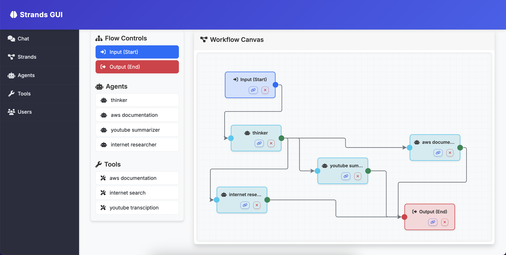

# Strands GUI

A web interface for visually configuring tools, creating agents, and building workflows.

Users can create Agents and workflows using Strands Agents, then interact and operate trough a chat interface.

DevOps can use MCP tools to integrate the UI with data sources.

Local and remote deployment options available.



 
## Local Development Setup

Runs locally in a python environment using a local sqlite database.

### Prerequisites

- Python 3.10
- AWS CLI configured with valid credentials
- Podman (for building containers)
- Terraform (for deployment)

### 1. Create Python Environment

```bash
# Create Python 3.10 virtual environment
python3.10 -m venv venv

# Activate the environment
source venv/bin/activate  # On macOS/Linux
# or
venv\Scripts\activate     # On Windows
```

### 2. Install Dependencies

```bash
pip install -r requirements.txt
```

### 3. Configure AWS Credentials

Ensure your AWS credentials are configured:

```bash
aws configure
```

Or set environment variables:

```bash
export AWS_ACCESS_KEY_ID=your_access_key
export AWS_SECRET_ACCESS_KEY=your_secret_key
export AWS_DEFAULT_REGION=us-east-1
```

### 4. Launch Application Locally

```bash
python app.py
```

The application will run on `http://0.0.0.0:5000` by default.

**Default Login:**
- Username: `admin@example.com`
- Password: *Randomly generated and displayed in console on first startup*


## Deployment

Will package and build the application, and deploy it using AppRunner.

The application will run in a VPC with a public endpoint, internet access, and will use Cognito for user managment.


### Prerequisites for Deployment

- **Podman**: Container runtime for building images
- **Terraform**: Infrastructure as Code tool
- **AWS CLI**: Configured with deployment permissions

### 1. Build Container Image

```bash
# Build the container image
podman build --platform=linux/amd64 -t strands-gui:latest .
```

### 2. Deploy Infrastructure

```bash
# Initialize Terraform
terraform init

# Plan the deployment
terraform plan

# Apply the infrastructure
terraform apply
```

### 3. Push Image and Deploy

The Terraform configuration automatically:
- Creates an ECR repository
- Builds and pushes the Docker image using Podman
- Deploys to AWS App Runner
- Sets up AWS DSQL database
- Configures AWS Cognito for authentication

### 4. Post-Deployment Configuration

After deployment, update Cognito callback URLs:

```bash
# Get the command from Terraform output
terraform output update_cognito_instructions

# Run the AWS CLI command provided in the output
```

### Environment Variables

The following environment variables are configured automatically during deployment:

- `SQLALCHEMY_DATABASE_URI`: AWS DSQL endpoint
- `COGNITO_ENABLED`: Set to `true`
- `COGNITO_USER_POOL_ID`: Auto-configured
- `COGNITO_CLIENT_ID`: Auto-configured
- `COGNITO_DOMAIN`: Auto-configured
- `COGNITO_REDIRECT_URI`: Auto-configured

### Deployment Outputs

After successful deployment, Terraform provides:

- **App URL**: The public URL of your deployed application
- **Admin Credentials**: Default admin user credentials
- **DSQL Cluster ARN**: Database cluster identifier

## Architecture

- **Frontend**: FastAPI with Jinja2 templates
- **Database**: SQLite (local) / AWS DSQL (production)
- **Authentication**: Local users (dev) / AWS Cognito (production)
- **Container**: Podman-built Docker image
- **Hosting**: AWS App Runner
- **Infrastructure**: Terraform-managed AWS resources

## Development Notes

- The app uses FastAPI instead of Flask (despite some legacy references)
- Built-in tools are automatically available to agents
- Custom tools can be created via the web interface
- Workflows support visual node-based editing
- Real-time chat interface for agent interaction
